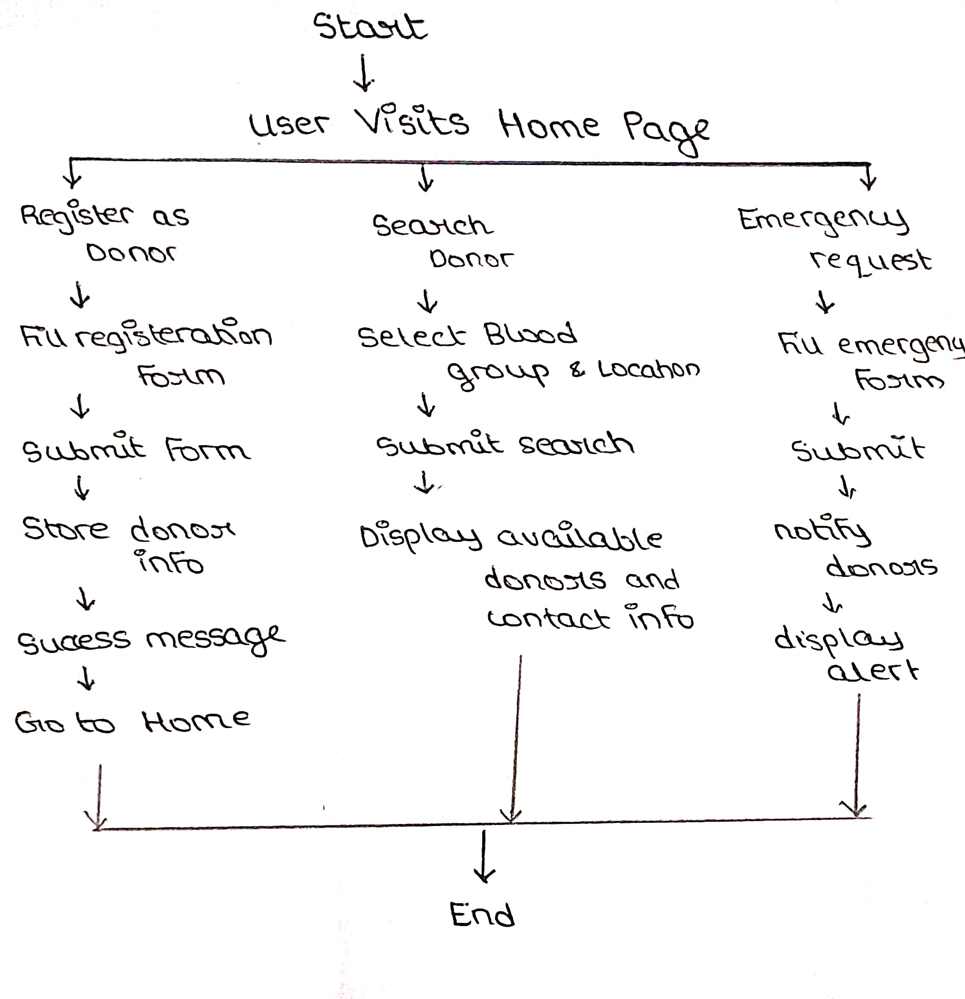

  

# DONOR CONNECT 🎯

## Basic Details

### Team Name: [ERROR 502]

### Team Members
- Member 1: DEVI PRADEEP - Sree Narayana Gurukulam College of Engineering Kolenchery
- Member 2: SIVANANDA V A - Sree Narayana Gurukulam College of Engineering Kolenchery

### Hosted Project Link
https://devi-pradeep.github.io/ThinkHerHack/

### Project Description
Donor Connect is a web platform that connects blood donors with those in need. Users can register as donors, search for available blood types in their area, and send emergency requests to save lives quickly.

### The Problem statement
Finding blood donors quickly is very difficult in emergency situations like accidents,rare blood group needs, surgeries etc..
CURRENT ISSUES:
* No real time availability of donors
* Manual searching through contacts in social media
* Lack of location-based filtering
* Blood banks may not always have required blood type
* Time delay can lead to loss of life.

### The Solution
Donors can register on the platform and update their availability in real-time, including blood type and location. Patients or hospitals can submit urgent blood requests instantly. The system automatically finds and notifies the nearest matching donors. Emergency alerts are sent immediately to ensure timely response and reduce life-threatening delays.

---

## Technical Details

### Technologies/Components Used

**For Software:**
- Languages used: HTML, CSS, JavaScript
- Tools used: VS Code, GitHub Pages

---

## Features

Key features of your project:
- Feature 1: Donors can register and update availability
- Feature 2: Patients or hospital can request blood instantly
- Feature 3: System matches nearest available donors
- Feature 4: Emergency alerts are sent in real-time.

---

## Project Documentation

### For Software:

#### Screenshots (Add at least 3)

#### Diagrams

Final Product

---

#### App Flow Diagram

Made with ❤️ at TinkerHub
